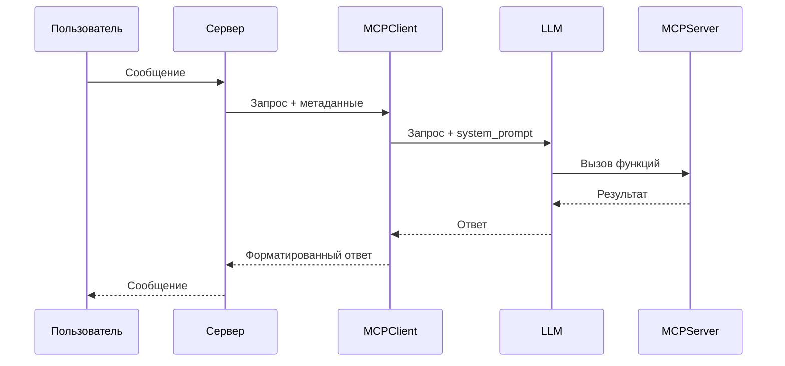

# Описание проекта и его структура

## Описание проекта

Проект представляет собой систему взаимодействия пользователя с большой языковой моделью (LLM) через различные клиентские интерфейсы.

### Процесс взаимодействия:

1.  **Запрос пользователя:** Пользователь отправляет сообщение через выбранный клиент.
2.  **Прием сообщения на серверной стороне:** Серверная часть клиента принимает сообщение.
3.  **Передача в API (MCP-клиент):** Сообщение пользователя передается в центральный API. Этот модуль служит общей точкой входа для всех серверных частей клиентов.
4.  **Взаимодействие API с LLM:**
    *   API содержит `system_prompt` с инструкциями для LLM.
    *   Команды и доступные функции для LLM динамически получаются с MCP-серверов для обеспечения актуальности и контроля доступа (в зависимости от тарифа пользователя).
    *   LLM получает сообщение пользователя, `system_prompt` и информацию о доступных функциях.
    *   LLM использует функции доступных пользователю MCP-серверов для обработки запроса и составления ответа.
5.  **Возврат ответа:** LLM возвращает сформированный ответ в API.
6.  **Передача ответа клиенту:** API передает ответ на сервер клиента, с которого был отправлен запрос.
7.  **Доставка ответа пользователю:** Сервер клиента отправляет ответ обратно пользователю.

### Содержание system_prompt:
1.  **Стиль общения**
2.  **Доступные функции (tools)**
3.  **Дополнительные указания:**
    *   Составление плана выполнения задачи
    *   Обработка ошибок
    *   Конфиденциальность
    *   Безопасность
    *   Формат ответа
    *   Работа с контекстом
    *   Ограничения
    *   Уточнение
    *   Мультимодальность
    *   Персонализация

### Основные возможности MCP-серверов:
1.  **Работа с текстом;**
2.  **Поиск в интернете;**
3.  **Работа с файлами;**
4.  **Генерация изображений;**
5.  **Написание программного кода.**

## Структура проекта

```mermaid
graph LR
    A[cli-клиент] <--> B[cli-сервер]
    C[веб-клиент] <--> D[веб-сервер]
    E[телеграмм-клиент] <--> F[телеграмм-сервер]
    
    B <--> G["Gateway (Шлюз)"]
    D <--> G
    F <--> G

    G <--> H["API (MCP-клиент)"]
    
    H <--> I[LLM]
    I <--> J["боты (MCP-серверы)"]
    
    style G fill:#c10,stroke:#333
    style H fill:#060,stroke:#333
    style I fill:#404,stroke:#333
    style J fill:#069,stroke:#333
```

### Схема взаимодействия (Sequence Diagram)

### Схема потока данных (Flowchart)

```mermaid
graph TD
    subgraph Клиентские серверы
        F[Telegram-сервер] -->|Запрос| G
        D[Веб-сервер] -->|Запрос| G
        B[CLI-сервер] -->|Запрос| G
    end
    
    subgraph Ядро системы
        G[API Gateway] -->|System Prompt + Запрос| H[LLM]
        H --> |Вызов функций| I[Боты]
        I --> |Результат| H
        H --> |Ответ| G
    end

    style G fill:#060,stroke:#333
    style H fill:#404,stroke:#333
    style I fill:#069,stroke:#333
```
