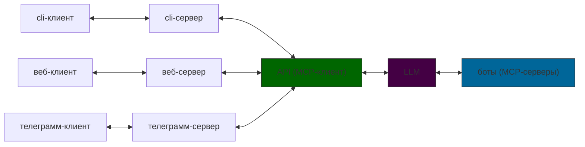

### Структура проекта

```mermaid
graph LR
    A[cli-клиент] <--> B[cli-сервер]
    C[веб-клиент] <--> D[веб-сервер]
    E[телеграмм-клиент] <--> F[телеграмм-сервер]
    
    B <--> G["API (MCP-клиент)"]
    D <--> G
    F <--> G
    
    G <--> H[LLM]
    H <--> I["боты (MCP-серверы)"]
    
    style G fill:#060,stroke:#333
    style H fill:#404,stroke:#333
    style I fill:#069,stroke:#333
```